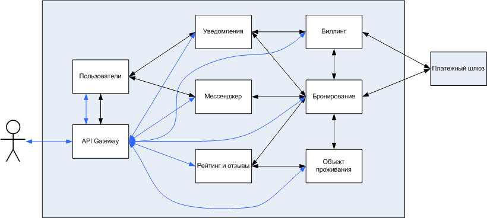

# Пользовательские сценарии

1. Когда авторизованный пользователь вводит даты для бронирования жилья, количество лиц И название гостиницы/хостела/апартаментов ИЛИ города.
   Тогда появляется список доступного для бронирования жилья.
   В карточке жилья пользователь видит: название, адрес, изображение, рейтинг, цену для минимальных условий размещения.

2. Когда пользователь выбирает один из вариантов проживания.
   Тогда он переходит на страницу с полным описанием бронируемого жилья, на которой отображена информация: название, адрес, изображения, рейтинг, описание, цены для разных условий размещения с кол-вом свободных мест, отзывы, форма для отправки вопросов администратору объекта для проживания (АОП).

3. Когда пользователь выбрал конкретные условия размещения и нажимает кнопку "бронирую".
   Тогда он переходит на страницу подтверждения бронирования, на которой отображается детальная информация о времени, цене, условиях бронирования, форма указания контактных данных, выбор времени и способа оплаты.

4. Когда пользователь нажимает кнопку "завершить бронирование".
   Если он выбрал время оплаты при заезде, то бронирование считается завершенным. Ему приходит письмо на электронную почту с деталями бронирования, а также аналогичное сообщение в диалог мессенджера. В системе отмечается, что выбранное пользователем жилье становится недоступным для резервирования другими пользователями.
   Если он выбрал оплату сейчас, то перенаправляется на страницу оплаты.

5. Когда пользователь оплачивает бронирование
   Тогда переходит на страницу с текущим статусом бронирования. Ему приходит письмо на электронную почту с деталями бронирования, а также аналогичное сообщение в диалог мессенджера. В системе отмечается, что выбранное пользователем жилье становится недоступным для резервирования другими пользователями. Начисляется комиссия для объекта проживания.

6. Когда пользователь отменяет бронирование.
   Тогда у него запрашивается подтверждение действия с подробными условиями отмены бронирования.
   Если пользователь подтверждает.
   Тогда ему возвращается средства за бронирования согласно условиям. Ему приходит письмо на электронную почту с подтверждением отмены бронирования, а также аналогичное сообщение в диалог мессенджера. В системе отмечается, что выбранное пользователем жилье становится доступным для резервирования другими пользователями. Если была начислена комиссия объекту проживания, то она отменяется.

7. Когда пользователь открывает историю бронирований.
   Тогда ему отображается список бронирований в порядке убывания даты с информацией: статус, даты, стоимость, название места проживания.

8. Когда пользователь открывает бронирование.
   Тогда ему отображается подробная информация о нем: дата, стоимость, условия размещения, статус.
   В зависимости от статуса бронирования его можно отменить, оплатить.

9. Когда пользователь открывает раздел с сообщениями.
   Тогда он видит список мест проживания, в адрес которых он отправлял сообщения, совершал бронирования.
   Выбирая каждое из них, открывается диалог с историей сообщений и возможностью отправить новые сообщения

10. Когда текущая дата становится больше даты окончания оплаченного бронирования.
    Тогда у пользователя появляется возможность поставить оценку и написать отзыв о проживании.

11. Когда проходит X дней после получения возможности оставить отзыв и оценку.
    Тогда у пользователя пропадает возможность выполнить эти действия.

12. АОП начинает работу с сервисом с создания объекта для проживания.

13. АОП может редактировать данные объекта для проживания: название, адрес, изображения, описание.

14. АОП может добавлять/редактировать/удалять различные условия размещения (количество человек в номере, комфортабельность, цена).

15. Когда АОП открывает объект для проживания
    Тогда отображается информация на ближайшие даты с состоянием номерного фонда и возможностью открыть делали бронирования каждого номера.

16. АОП может резервировать номера, чтобы исключить их возможность бронирования пользователями, например, для ремонта.

17. Когда АОП открывает раздел с сообщениями.
    Тогда он видит список пользователей, что ранее отправляли сообщения администрируемому объекту проживания или бронировали его.
    Выбирая каждое из них, открывается диалог с историей сообщений и возможностью отправить новые сообщения выбранному пользователю.

18. Когда АОП отменяет бронирование клиента.
    Тогда пользователю отправляется сообщение об отмене бронирования, а также аналогичное сообщение в диалог мессенджера. Зарезервированные места становятся доступными для бронирования, изменяется статус бронирования. Если бронирование было оплачено, то оплата возвращается пользователю. Если была начислена комиссия объекту проживания, то она отменяется.

19. Когда клиент оплачивает бронирование при заселении.
    Тогда АОП выполняет отметку об оплате бронирования. Начисляется комиссия для объекта проживания.

20. Когда клиент оставляет комментарий Для объекта проживания.
    Тогда АОП может ответить на данный комментарий.

21. Когда АОП оплачивает комиссию.
    Ему приходит письмо на электронную почту с деталями платежа и текущим состоянием баланса и начисленной комиссии.

# Общая схема взаимодействия сервисов

# Описание сервисов

## Сервис "Пользователи"

### Назначение:
Управление учетными данными пользователей. Содержит информацию о контактах и роли на портале. Он же используется как сервис аутентификации.

### Запросы:
- Получение пользователей в системе на основе заданных критериев фильтрации и пагинации в виде списка их идентификаторов.
  GET /api/v1/user/?...
- Получение информации о пользователе.
  GET /api/v1/user/{userId}

### Команды:
- Регистрация нового пользователя.
  POST /api/v1/user/
- Изменение данных пользователя.
  PUT /api/v1/user/{userId}
- Вход пользователя или администратора объекта проживания в портал.
  POST /api/v1/user/login
- Закрытие сессии.
  POST /api/v1/user/logout

### События:
UserCreated, UserContactsChanged

### Зависимости:
-

## Сервис "Мессенджер"

### Назначение:
Обмен сообщениями между пользователем и администратором объекта проживания.
Автоматическая отправка сообщений для случаев успешного создания бронирования и его отмены при получении соответствующих событий. События лишь уведомляют сервис о событиях, всю необходимую информацию получает с помощью запросов к сервису "Бронирование".

### Запросы:
- Получение списка диалогов пользователя на основе заданных критериев фильтрации и пагинации в виде списка идентификаторов пользователей, с которым существует диалог.
  GET /api/v1/messenger/{userId}/?...
- Получение сообщение диалога между пользователями на основе заданных критериев пагинации.
  GET /api/v1/messenger/{userId}/{userId}

### Команды:
- Отправка сообщения в диалоге между пользователями.
  POST /api/v1/messenger/{userId}/{userId}

### События:
-

### Зависимости:
- API сервиса "Бронирование" для получении информации о них.
- События BookingCompleted, BookingCanceled сервиса "Бронирование".

## Сервис "Уведомления"

### Назначение:
Отправка во внешние информационные системы сообщений по различным протоколам. В рассматриваемом примере только по email.
Автоматическая отправка email для случаев успешного создания бронирования и его отмены при получении соответствующих событий.
Автоматическая отправка email при получении события об оплате учтенной комиссии.
События лишь уведомляют сервис о событиях, всю необходимую информацию получает с помощью запросов к сервисам "Пользователи", "Бронирование", "Биллинг".

### Запросы:
- Получение списка уведомлений в виде email пользователю на основе заданных критериев фильтрации и пагинации в виде списка их идентификаторов.
  GET /api/v1/notification/email/{userId}/?...
- Получение информации о конкретном уведомлении по email.
  GET /api/v1/notification/email/{notificationId}

### Команды:
- Отправка email пользователю.
  POST /api/v1/notification/email/{userId}

### События:
NotificationEmailSent, NotificationEmailFailed.

### Зависисмости:
- API сервиса "Пользователи" для получении информации о них.
- Событие UserContactsChanged сервиса "Пользователи".
- API сервиса "Бронирование" для получении информации о них.
- События BookingCompleted, BookingCanceled сервиса "Бронирование"
- API сервиса "Биллинг" для получении информации о балансе АОП и назначенной комиссии.
- События BillingPaid сервиса "Биллинг".

## Сервис "Биллинг"

### Назначение:
Учет комиссии сервиса за оплаченные бронирования.
При оплате бронирования пользователем онлайн или подтверждении оплаты бронирования при заселении администратором объекта проживания назначается комиссия.
При отмене бронирования назначенная комиссия откатывается.
Комиссия начисляется и откатывается сервисом "Бронирование".

### Запросы:
- Получение информации о текущем состоянии комиссии и баланса администратора объекта проживания.
  GET /api/v1/billing/{userId}/
- Получение истории платежей и назначенных/отмененных комиссиях за бронирования на основе заданных критериев фильтрации и пагинации в виде списка идентификаторов транзакций.
  GET /api/v1/billing/transaction/{userId}/?...
- Получение информации о транзакции.
  GET /api/v1/billing/transaction/{userId}/{transactionId}

### Команды:
- Начисление комиссии сервисом "Бронирование" за оплаченное брнирование.
  POST /api/v1/billing/charge/{bookingId}/
- Отмена комиссии сервисом "Бронирование" за оплаченное брнирование.
  POST /api/v1/billing/uncharge/{bookingId}/
- Оплатить комиссию. Создается новая транзакция на оплату комиссии. Редирект на платежный шлюз с информацией, необходимой для платежа.
  POST /api/v1/billing/transaction/{userId}/
- Изменение статуса транзакции об оплате комиссии через редирект с платежного шлюза.
  PUT /api/v1/billing/transaction/{userId}/{transactionId}

### События:
BillingPaid.

### Зависимости:
-

## Сервис "Рейтинг и отзывы"

### Назначение:
Управление оценками и отзывами объектов проживания.
Возможность поставить оценку и написать отзыв для объекта проживания доступна пользователям в течении некоторого времени после завершения оплаченного бронирования.
Администратор объекта проживания может ответить на отзыв пользователя.
События лишь уведомляют сервис о событиях, всю необходимую информацию получает с помощью запросов к сервису "Бронирование".

### Запросы:
- Получение информации о возможности пользователя оценить и оставить комментарий к объекту проживания.
  GET /api/v1/rating/ability/{accommodationId}/{userId}
- Получение информации о рейтинге объекта проживания.
  GET /api/v1/rating/mark/{accommodationId}
- Получение списка отзывов пользователей и администраторов объекта проживания на основе заданных критериев фильтрации и пагинации в виде списка их идентификаторов.
  GET /api/v1/rating/review/{accommodationId}/?...
- Получение информации о комментарии пользователя или администраторов объекта проживания.
  GET /api/v1/rating/review/{accommodationId}/{reviewId}

### Команды:
- Оценка пользователем объекта проживания.
  POST /api/v1/rating/mark/{accommodationId}/{userId}
- Публикация пользователем отзыва об опыте проживания в объекте проживания.
  POST /api/v1/rating/review/{accommodationId}/{userId}
- Ответ администратора объекта проживания на отзыв пользователя.
  POST /api/v1/rating/response/{reviewId}/{userId}

### События:
RatingChanged.

### Зависимости:
- API сервиса "Бронирование" для получении информации о них.
- События BookingPaid, BookingCanceled сервиса "Бронирование".

## Сервис "Объект проживания"

### Назначение:
Управление объектом проживания: создание, редактирование описания.
Управление номерным фондом объекта проживания: создание/редактирование/удаление номеров с различными условиями размещения, например, количество мест в номере, комфортабельность, цена.
Получение информации о доступности номерного фонда и возможность резервирования администратором объекта проживания, например, для ремонта.
События лишь уведомляют сервис о событиях, всю необходимую информацию получает с помощью запросов к сервису "Рейтинг и отзывы".

### Запросы:
- Получение объектов проживания на основе заданных критериев фильтрации и пагинации в виде списка их идентификаторов.
  GET /api/v1/accommodation/?...
- Получение информации об объекте проживания.
  GET /api/v1/accommodation/{accommodationId}
- Получение информации об условиях размещения и их доступности в указанные даты.
  GET /api/v1/accommodation/{accommodationId}/room/

### Команды:
- Создание объекта проживания администратором.
  POST /api/v1/accommodation
- Редактирование объекта проживания администратором.
  PUT /api/v1/accommodation/{accommodationId}
- Создание администратором условий размещения (номера).
  POST /api/v1/accommodation/{accommodationId}/room
- Редактирование администратором условий размещения (номера).
  PUT /api/v1/accommodation/{accommodationId}/{roomId}
- Удаление администратором условий размещения (номера).
  DELETE /api/v1/accommodation/{accommodationId}/{roomId}
- Резервирование номера сервисом "Бронирование" на указанные даты.
  POST /api/v1/accommodation/booking/{accommodationId}/{roomId}/{bookingId}
- Резервирование номера администратором на указанные даты.
  POST /api/v1/accommodation/reserve/{accommodationId}/{roomId}
- Отмена резервирования номера сервисом "Бронирование" или администратором на указанные даты.
  POST /api/v1/accommodation/unreserve/{accommodationId}/{roomId}

### События:
-

### Зависимости:
- API сервиса "Рейтинг и отзывы" для получении информации о них.
- Событие RatingChanged для кэширования текущего значения рейтинга и его использовании при фильтрации и сортировке списка объектов проживания.

## Сервис "Бронирование"

### Назначение:
Управление жизненным циклом бронирования объекта проживания.
Оркестрирует процедуру бронирования, взаимодействуя с сервисами "Объект проживания" и "Биллинг".

### Запросы:
- Получение списка бронирований на основе заданных критериев фильтрации и пагинации в виде списка их идентификаторов.
  GET /api/v1/booking/?...
- Получение информации о бронировании.
  GET /api/v1/booking/{bookingId}

### Команды:
- Создание пользователем бронирования для объекта проживания.
  POST /api/v1/booking
- Ввод контактных данных, предпочтений, выбор условий оплаты и завершение пользователем бронирования объекта проживания.
  POST /api/v1/booking/reserve/{bookingId}
- Online оплата пользователем бронирования объекта проживания и редирект на платежный шлюз.
  POST /api/v1/booking/pay_online/{bookingId}
- Изменение статуса бронирования через редирект с платежного шлюза.
  POST /api/v1/booking/paid_online/{bookingId}
- Подтверждение оплаты бронирования администратором объекта проживания при заезде.
  POST /api/v1/booking/paid_offline/{bookingId}
- Отмена бронирования пользователем или администратором объекта проживания.
  DELETE /api/v1/booking/{bookingId}

### События:
BookingCompleted, BookingPaid, BookingCanceled.

### Зависимости:
- API сервиса "Объект проживания" для резервирования и отмены резервирования номеров.
- API сервиса "Биллинг" для начисления или отмены комиссии за оплаченные бронирования.
